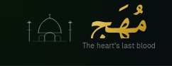
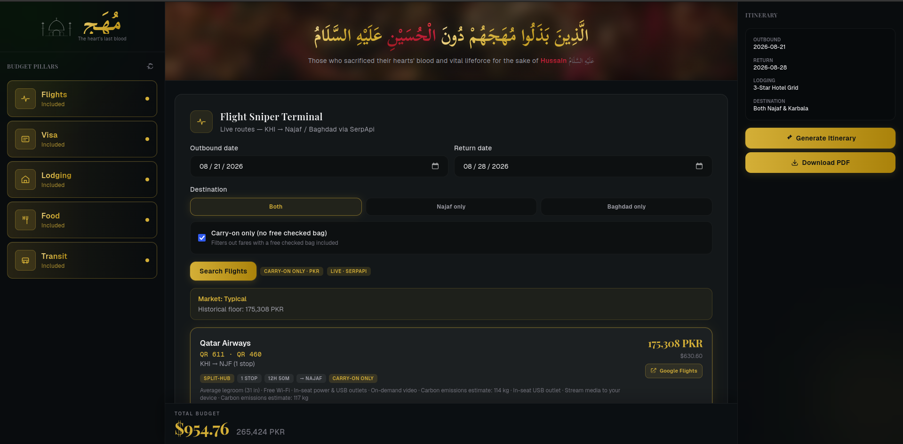

<div align="center">



# مُهَج — Muhaj

**DIY Budget Ziyarat Planner**

*"Those who sacrificed their hearts' blood and vital lifeforce for the sake of Hussain عَلَيْهِ السَّلَامُ"*

[](https://muhaj.qzz.io)
[](https://nextjs.org)
[](https://www.typescriptlang.org)
[](https://tailwindcss.com)
[](https://ai.google.dev)



</div>

---

## 📖 About

**Muhaj** is a free, open-source pilgrimage planning tool built for Shia Muslims travelling from Pakistan (KHI) to the holy cities of **Najaf** and **Karbala**, Iraq — without a travel agency.

It brings together every cost pillar of a Ziyarat trip into one place: live flight prices, visa requirements, lodging options, food budgets, inter-city transit, and miscellaneous expenses — then uses **Google Gemini AI** to generate a personalised itinerary and lets you export everything as a **PDF** to take offline.

> Built with love for the lovers of Ahlul Bayt عَلَيْهِم السَّلَامُ

---

## ✨ Features

### ✈️ Flight Sniper Terminal
- Live flight search from **KHI → Najaf / Baghdad** powered by **SerpApi**
- Filter by carry-on only (no checked bag) to find the cheapest fares
- Shows historical price floor for comparison
- Direct links to **Google Flights** to book

### 🛂 Visa Roadmap
- Step-by-step guide for the **Iraqi e-Visa** (evisa.iq) — no agency needed
- Official fee breakdown ($80 USD)
- Full required documents checklist

### 🏨 Accommodation Hub
- Choose between a **paid economy inn** (~$15/night) or **free Husseiniya lodging**
- Calculates lodging subtotal based on your number of nights

### 🍽️ Sustenance Log
- Toggle between **free Mawkib catering** or a daily local food budget (~$8/day)
- Curated map of authentic local eateries near the shrines in Karbala & Najaf

### 🚌 Public Transit Router
- Pre-loaded routes between holy cities:
  - Najaf ↔ Karbala (Coaster mini-bus)
  - Karbala ↔ Kazmain (Gara shared taxi)
  - Karbala ↔ Samarra
  - Kazmain ↔ Samarra
- Prices in both **USD** and **Iraqi Dinar (IQD)**

### 💸 Total Budget Dashboard
- Live running total across all pillars
- Displays in both **USD** and **PKR**
- Add custom miscellaneous expenses (SIM cards, souvenirs, etc.)

### 🤖 AI Itinerary Generator
- Powered by **Google Gemini**
- Generates a day-by-day personalised Ziyarat itinerary based on your dates, destination, and lodging preference

### 📄 PDF Export
- Download your full budget breakdown and itinerary as a clean, shareable PDF

---

## 🛠️ Tech Stack

| Technology | Purpose |
|---|---|
| [Next.js 16](https://nextjs.org) | Full-stack React framework |
| [React 19](https://react.dev) | UI library |
| [TypeScript 5](https://www.typescriptlang.org) | Type safety |
| [Tailwind CSS v4](https://tailwindcss.com) | Styling |
| [Google Generative AI](https://ai.google.dev) | AI itinerary generation |
| [SerpApi](https://serpapi.com) | Live flight search |
| [@react-pdf/renderer](https://react-pdf.org) | PDF rendering & export |
| [jsPDF](https://github.com/parallax/jsPDF) | PDF generation |

---

## 🚀 Getting Started

### Prerequisites

- **Node.js** v18 or higher
- A **Google Gemini API key** — [get one here](https://ai.google.dev)
- A **SerpApi key** — [get one here](https://serpapi.com)

### Installation

```bash
# 1. Clone the repository
git clone https://github.com/hussainabbasss/muhaj.git
cd muhaj

# 2. Install dependencies
npm install

# 3. Set up environment variables
cp .env.example .env.local
```

### Environment Variables

Open `.env.local` and fill in your keys:

```env
GEMINI_API_KEY=your_google_gemini_api_key
SERPAPI_KEY=your_serpapi_key
```

### Running Locally

```bash
npm run dev
```

Open [http://localhost:3000](http://localhost:3000) in your browser.

---

## 📁 Project Structure

```
muhaj/
├── app/              # Next.js App Router — pages, layouts, API routes
├── components/       # Reusable UI components
├── context/          # Architecture & project documentation
│   ├── project-overview.md
│   ├── architecture-context.md
│   ├── ui-context.md
│   ├── code-standards.md
│   ├── ai-workflow-rules.md
│   └── progress-tracker.md
├── hooks/            # Custom React hooks
├── lib/              # Utility functions & shared logic
├── public/           # Static assets (logo, images)
└── .env.example      # Environment variable template
```

---

## 📦 Scripts

```bash
npm run dev      # Start development server
npm run build    # Build for production
npm run start    # Start production server
npm run lint     # Lint the codebase
```

---

## 🌐 Deployment

Muhaj is deployed on **Netlify** with a custom domain via **DigitalPlat FreeDomain**.

To deploy your own instance:

1. Push the repo to GitHub
2. Connect to [Netlify](https://netlify.com) and import the repo
3. Add your environment variables under **Site Settings → Environment Variables**
4. Deploy — Netlify handles the build automatically

---

## 🤝 Contributing

Contributions, bug reports, and feature requests are welcome!

1. Fork the project
2. Create your feature branch: `git checkout -b feature/your-feature`
3. Commit your changes: `git commit -m 'Add your feature'`
4. Push to the branch: `git push origin feature/your-feature`
5. Open a Pull Request

---

<div align="center">

Built with ❤️ for the lovers of Ahlul Bayt

**[→ Open App](https://muhaj.qzz.io)**

</div>
